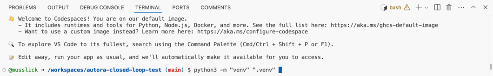

# Setup Project

## Set Up Environment

Once you have cloned your repository or opened it in codespaces, it is time to set up your environment. Here, we will use a Python virtual environment to manage dependencies.

!!! success
    We recommend setting up your development environment using a manager like `venv`, which creates isolated python 
    environments. Other environment managers, like 
    [virtualenv](https://virtualenv.pypa.io/en/latest/),
    [pipenv](https://pipenv.pypa.io/en/latest/),
    [virtualenvwrapper](https://virtualenvwrapper.readthedocs.io/en/latest/), 
    [hatch](https://hatch.pypa.io/latest/), 
    [poetry](https://python-poetry.org), 
    are available and will likely work, but will have different syntax to the syntax shown here. 

    Our packages are set up using `virtualenv` with `pip`  

In the `<project directory>`, run the following command to create a new virtual environment in the `.venv` directory.

```shell
python3 -m "venv" ".venv" 
```


!!! hint
    If you have multiple Python versions installed on your system, it may be necessary to specify the Python version when creating a virtual environment. For example, run the following command to specify Python 3.8 for the virtual environment. 
    ```shell
    python3.8 -m "venv" ".venv" 
    ```

Activate it by running
```shell
source ".venv/bin/activate"

## Installation

First, install the cookiecutter package using pip via

```shell
pip install cookiecutter
```

Then we install some python dependencies:
```shell
pip install -r requirements.txt
```

We  will also use firebas-tools:
```shell
npm install -g firebase-tools
```

Once you've confirmed your installation, you can create the project by running 
```shell
cookiecutter https://github.com/AutoResearch/autora-user-cookiecutter
```

- Advanced features -> yes
- choose one or more theorists
- choose one or more experimentalists
- !!! Install autora[experiment-runner-firebase-prolific]
- !!! Set up a Firebase Experiment -> yes
- Type of Project -> SweetBean

***
Next: [3-Setup-Firebase](./3-Setup-Firebase.md)
***

**Navigate Through the Tutorial**:
- Use the navigation buttons in the preview pane to move through the tutorial steps.
- After pressing on links to navigate, click on the left editor window to refocus.
